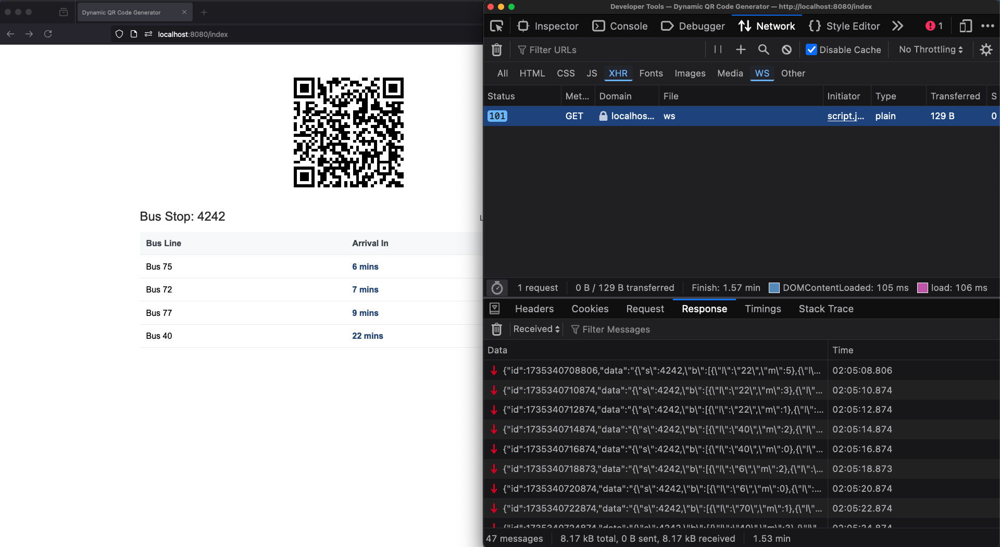
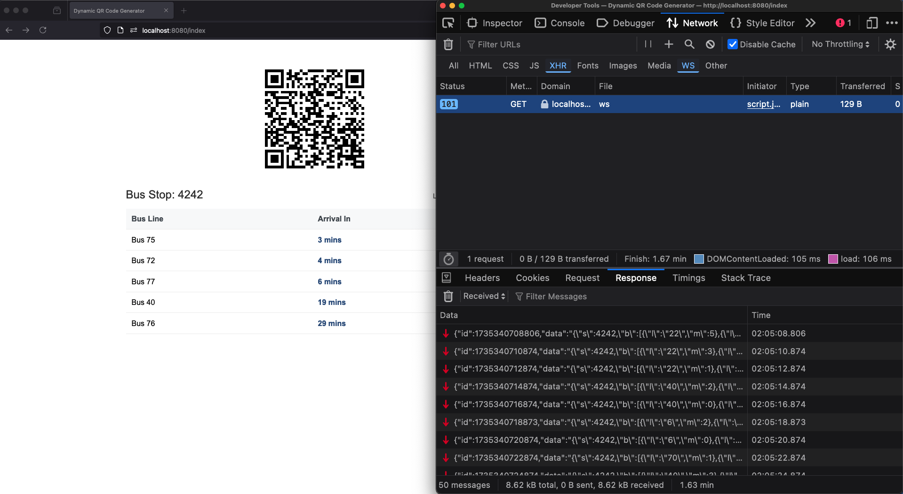

# Dynamic QR Code Bus Schedule Display

A real-time bus schedule display system that uses dynamic QR codes to share information without requiring end-users to have internet connectivity. The system simulates a bus stop display where arrival times are continuously updated and shared via QR codes that contain the actual schedule data rather than URLs.

## Core Concept

Traditional QR codes typically contain static URLs that require internet connectivity to access information. This project takes a different approach:

- QR codes contain the actual JSON data of bus schedules
- Updates every 2 seconds with new arrival times
- Users can scan and get real-time information without internet access
- Perfect for public displays in areas with limited connectivity


## Screenshots






> Note: The web interface shown above includes a table view for demonstration purposes. In production, this could be replaced with a monochrome LCD/LED display showing only the QR code, making it more suitable for outdoor bus stops and reducing power consumption.

## Use Cases

- Bus stops without reliable internet connectivity
- Public transport information displays
- Event schedules in areas with poor network coverage
- Any scenario requiring offline access to frequently updated information
- Digital signage with real-time data access via QR codes


## How It Works

1. Server maintains a queue of buses and their arrival times
2. Every 2 seconds:
   - Existing bus times are decremented
   - New buses may be added to the queue
   - Arrived buses (time = 0) show "Almost there!"
   - Passed buses are removed from the queue
3. Current state is encoded into a QR code and displayed
4. Users scan QR code to get instant access to the latest schedule

## Features

- Real-time updates every 2 seconds
- Queue-based bus management
- Self-contained QR codes (no URL redirection)
- Automatic bus removal when arrival time reaches zero
- Responsive web interface
- WebSocket-based real-time updates
- Minimal and clean UI

## Technical Stack

- Backend: Go 1.21+
  - Gin web framework
  - WebSocket support
  - QR code generation
- Frontend: Pure JavaScript & CSS
  - No external dependencies
  - Responsive design
  - Real-time WebSocket updates

## Setup

1. Clone the repository
2. Install dependencies:
   ```bash
   go mod download
   ```
3. Run the application:
   ```bash
   go run main.go
   ```
4. Open `http://localhost:8080/index` in your browser

## Project Structure

```plaintext
.
├── assets/
│   ├── css/
│   │   └── style.css    # Styles for the web interface
│   └── js/
│       └── script.js    # Frontend WebSocket and UI logic
├── views/
│   └── index.tmpl       # HTML template
├── main.go              # Server implementation
├── go.mod              # Go module definition
└── README.md           # This file
```
## License

This project is licensed under the Mozilla Public License Version 2.0 - see the [LICENSE](LICENSE) file for details.